# Git Native Packaging

## Pristine Sources

We stand on the shoulders of giants. So in order to define the
future we should learn from the past. So let's take a look back.

Packaging for a distribution means taking sources from upstream
projects, applying fixes and modifications, adding some
configuration and then build the result by calling some commands.

RPM formalized the process following a "pristine sources"
philosophy[^1][^2]. The idea came from an old distribution called
BOGUS[^3][^4]. The approach is basically to take the unmodified
sources as released by upstream and store required changes in the form
of patches as well as a build description next to them. In RPM speak
the build description is called "spec file" and contains
instructions on how to apply the patches to the sources and how to
build the sources to produce binary packages.

Oversimplified example:

	Name:    hello
	Version: 1.0
	Source:  hello-1.0.tar.gz
	Patch:   hello-bugfix.patch

	%prep
	%autosetup

	%build
	./configure --prefix=/usr
	make

	%install
	make install

	%files
	/usr/bin/hello

A crucial aspect is that it must be easy for humans to understand
what is going on. In the above example that should be pretty
obvious. The only magic in there is the `%autosetup` macro that
extracts the tarball and applies the patch.

In order to add a new patch, just add another `Patch` line. To
upgrade to a newer version, adjust the version, change the tarball
and potentially rebase the patches.

That makes it easy for developers of the distribution as the
standard procedure helps to scale. Any packager basically knows how
to update any package. Also customers who like to take advantage
open source can apply customizations in straight forward way based
on the distributions's sources.

## Git

Times have changed. The distributed version control system `git`
dominates the free software world. The vast majority of upstream
projects use `git` for development. So manually creating binary
tarballs and uploading them to some `ftp` server is not necessarily
the preferred method to release software anymore. Instead it's much
easier to create a signed git tag.

On the downstream side juggling tarballs and manually applying
patches is no longer a natural workflow. It would be much easier to
just branch the upstream code at the release tag and apply git
commits on top.

First we need to have a quick understanding how git works though. Git is a
content-addressable filesystem. It knows about some basic objects:

* blob: arbitrary data, ie file content
* tree: a directory listing that refers to other trees or blobs, giving them names and permissions
* commit: refers to a tree and ancestor commits to track changes over time. It also contains author and committer information.

All objects are hashed and typically referred to by their sha1 checksum. To
make it easier for humans there are named references as entry
points. The default entry point is called HEAD. So a simple repo with one file
could look like this:

    $ ls -l
    -rw-r--r-- 1 ln ln      4  1. Dez 17:39 foo
    drwxr-xr-x 8 ln ln    166  1. Dez 17:39 .git/
    $ cat .git/HEAD
    ref: refs/heads/main
    $ cat .git/refs/heads/main
    4fee468c4536b03b3c2cc068185eafa8998b57a5
    $ git cat-file -p 4fee468c4536b03b3c2cc068185eafa8998b57a5
    tree 6a09c59ce8eb1b5b4f89450103e67ff9b3a3b1ae
    author Ludwig Nussel <ludwig.nussel@suse.de> 1669912784 +0100
    committer Ludwig Nussel <ludwig.nussel@suse.de> 1669912784 +0100
    
    start
    $ git cat-file -p 6a09c59ce8eb1b5b4f89450103e67ff9b3a3b1ae
    100644 blob 5716ca5987cbf97d6bb54920bea6adde242d87e6    foo
    git cat-file -p 5716ca5987cbf97d6bb54920bea6adde242d87e6
    bar

To visualize this example we use different icons: blob
, tree , commit

So the example with one file would look like this:

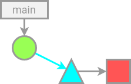

When adding new commit that adds a directory, the tree would refer
to the tree describing the subdirectory and the same blob as before.

    $ git ls-tree HEAD
    040000 tree ee314a31b622b027c10981acaed7903a3607dbd4    subdir
    100644 blob 5716ca5987cbf97d6bb54920bea6adde242d87e6    foo
    $ git ls-tree HEAD:d
    100644 blob 5716ca5987cbf97d6bb54920bea6adde242d87e6    bar

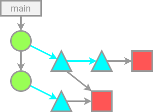

The important takeaway to understand from that is that _git_
actually stores snapshots of filesystem trees rather than diffs[^5]

## Pristine Sources and Git

Let's make up a simple example package. We assume the history has a
chain of three commits. There's a tag for version 1.0
while the main branch already advanced. . So
every commit in the history refers to a new version of a tree
(triangle):

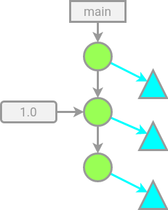

The example is a a simple C program and a Makefile so the tree
attached to the top commit of the _main_ branch looks like this:

	$ git ls-tree main
	100644 blob dc03f55b8fcc9d9a4522abae54ce79ebef15123d    Makefile
	100644 blob 33a1de5093676429c636cd7f5adb29d5df2a55b2    hello.c

In this case the tree is flat, ie no subdirectories.

In order to add a spec file and some changes to the _1.0_ release, one
could create a branch, e.g. _opensuse_. Changes and the spec file
could be split up into individual commits (_p1_ and _p2_ in the
example):

So the tree would look like this now:

	$ git ls-tree main
	100644 blob 637ad06d950498ac9652746d861c8dc9265f153c    Makefile
	100644 blob 088b6962e0ad4713e488fd4e394680ea8b4b452e    hello.c
	100644 blob bf22322d2da0b2799287949b546f9ca7da4e5355    hello.spec

And the chain of commits like this (omitting blobs for simplicity):

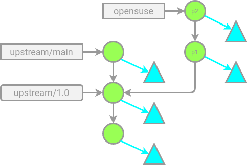

In this case the spec file does not need to list sources nor patches
as that's actually the current directory[^6]:

	Name: hello
	Version: 1.0

	%prep

	%build
	./configure --prefix=/usr
	make

	%instal
	make install

	%files
	/usr/bin/hello

The layout also makes it easy to see changes added in _opensuse_. They
are the commits until the last tag:

	$ git describe --tags --abbrev=0 opensuse
	1.0
	$ git log --graph --pretty=oneline --abbrev-commit 1.0..opensuse
	* 50ef197 add spec file
	* 424ae04 opensuse fixes

Now if upstream tags/releases a new version _1.1_ one would rebase
the changes on the new tag:

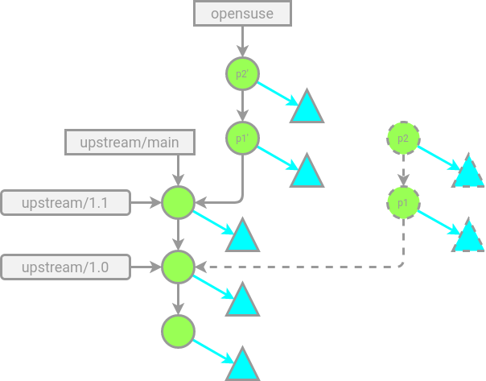

So by agreeing on some basic conventions like branch or remote names
(_upstream_/_opensuse_) a pristine source model can be achieved in pure git
based source storage.

## Storing the history

Now for the hard part. How to keep track of distro changes over
time? The attentive reader will have noticed that the rebase of the
_opensuse_ branch in the previous example would require a force push
of the branch to store it somewhere. That would lose the previous
revision and it's record of changes. In order to get inspiration to
solve that let's look at how the current tarball based method does
it in OBS.

### How OBS stores package revisions

In openSUSE the canonical storage for sources is the Open Build
Service. So for example in the _openSUSE:Factory_ project the
sources of the _lua-macros_ package look like this:

	$ osc api /source/openSUSE:Factory/lua-macros
	<directory name="lua-macros" rev="8" vrev="2" srcmd5="4cc16b450037cf14655c8f7f1e051d08">
	  <entry name="lua-macros.changes" md5="1def770c598063432a0f3ff4b9247ebb" size="2223" mtime="1662131628"/>
	  <entry name="lua-macros.spec" md5="5410b0139fddcdd14b370685380967de" size="1343" mtime="1630059097"/>
	  <entry name="macros.lua" md5="bd9dea0cdc46f3c5e9207de9722dd3ea" size="1420" mtime="1662126891"/>
	</directory>

I.e. a list of files and their checksum. The storage of revisions is
linear. In this example the previous revision is 7:

	osc api /source/openSUSE:Factory/lua-macros?rev=7
	<directory name="lua-macros" rev="7" vrev="1" srcmd5="c48ec52509ca28b0c2c24545dff34044">
	  <entry name="lua-macros.changes" md5="790add03dc9155e8ab06ddd0a98b5804" size="2000" mtime="1630143816"/>
	  <entry name="lua-macros.spec" md5="5410b0139fddcdd14b370685380967de" size="1343" mtime="1630059097"/>
	  <entry name="macros.lua" md5="bd9ee1ccdf9ee424164c257aa3780ec3" size="1105" mtime="1630145985"/>
	</directory>

Every revision has a comment attached:

	$ osc api /source/openSUSE:Factory/lua-macros/_history
	<revisionlist>
	  [...]
	  <revision rev="8" vrev="2">
	    <srcmd5>4cc16b450037cf14655c8f7f1e051d08</srcmd5>
	    <version>20210827</version>
	    <time>1662322280</time>
	    <user>dimstar_suse</user>
	    <comment>- Add LuaRocks macros:
	  * %luarocks_build
	  * %luarocks_install
	  * %luarocks_treedir
	</comment>
	    <requestid>1000927</requestid>
	  </revision>
	</revisionlist>

The same structure exists in devel projects, just with a different
linear history. So what a checkin to Factory in OBS means is
produce a new commit in Factory referring to the tree of the
submission but ignoring the history in the devel project.

Using the same visualization as in the _git_ example the situation
would look like this:

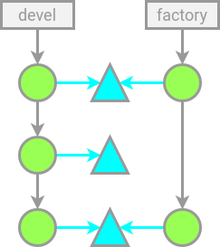

I.e. two disconnected histories but referring to the same files.

The very same could be done in _git_ actually. It's possible to load
the tree of a random commit into the index and commit the result:

	$ git read-tree --reset `git rev-parse "devel^{tree}"`
	$ git commit -m "new commit with tree from devel"

The goal isn't to emulate OBS though. The whole git history from
upstream as well as the opensuse modifications are meant to be
preserved.

### Eat the cake and have it too: rebase and merge at the same time

In contrast to OBS in git a commit can have multiple parents. So
instead of throwing away the history of a submission, it's actually
possible to refer to both the previous commit in factory, as well as
the history in the devel branch. That's a merge. However, with the
rebases going on as described previously a normal merge would lead
to conflicts. Factory however is not interested in resolving
conflicts. All that's needed is the tree of the top commit in a
submission.

Git already has an _ours_ strategy built in that produces a merge
commit that does not actually merge the other side but keeps
referring to the current tree. What's basically needed from the
point of view of the factory branch is a 'theirs' strategy that
ignores the current tree and just refers to the one submitted.

Such a strategy can be implemented as a small helper script:

	$ cat > ~/bin/git-merge-theirs <<EOF
	#!/bin/bash -e
	while [ "$1" != "--" ]; do
		shift
	done
	shift
	[ "$#" -eq 2 ]
	# Merge strategy that always uses the other tree, completely ignoring ours
	h="$1" # HEAD
	c="$2" # the actual merge commit
	tree="$(git rev-parse "$c^{tree}")"
	git read-tree --reset "$tree"
	EOF
	$ chmod 755 ~/bin/git-merge-theirs

This strategy applied on the previous git example one could use a
command like the following to merge the _opensuse_ branch into the
current (in this case _factory_) branch:

	$ git merge --allow-unrelated-histories -s theirs -m "merge devel branch" opensuse

Alternatively it's also possible to 'artificially' generate a commit
with the desired properties and advance the factory branch using low
level git commands. This method would work if the _factory_ branch
is not checked out:

    $ git commit-tree -p factory -p opensuse -m "merge devel branch" $(git rev-parse "opensuse^{tree}")
    0852de2328a87546a60a19d2c99d0e9658f6a7a2
    $ git update-ref factory 0852de2328a87546a60a19d2c99d0e9658f6a7a2

Both methods would produce a graph like this:

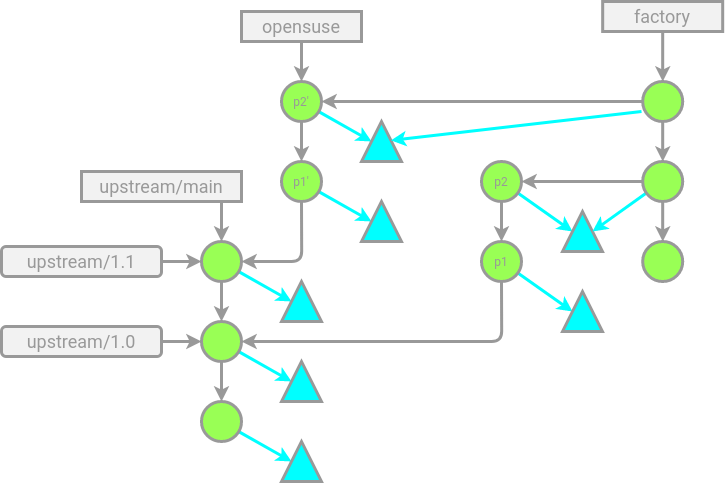

Now when following the first parent in the _factory_ branch one
actually gets a result similar to OBS. I.e. commits that refer to
the trees of the submissions.

In addition the second parent in _factory_ commits always points to
the commit of submissions, therefore the whole history attached to
it.

### Caveats

#### Incorrect branches

A naive _git branch_ of the _factory_ branch would yield the correct
tree but not the correct chain of commits. No information is lost way but
history may look confusing and will be hard to visualize. So in order to keep a
linear history that resembles pristine source patches such a setup must
be detected by tooling and prevented.

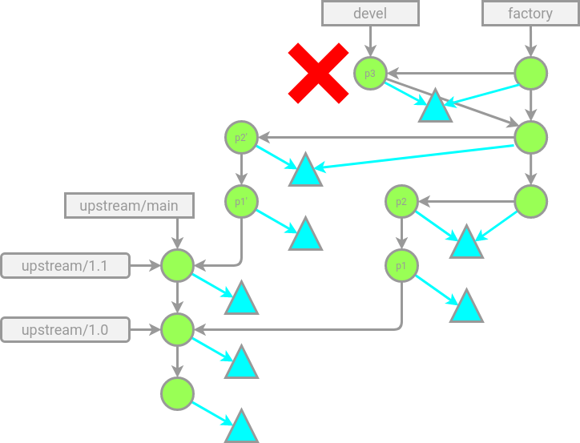

A correct branch needs to be based on the second parent of
_factory_:

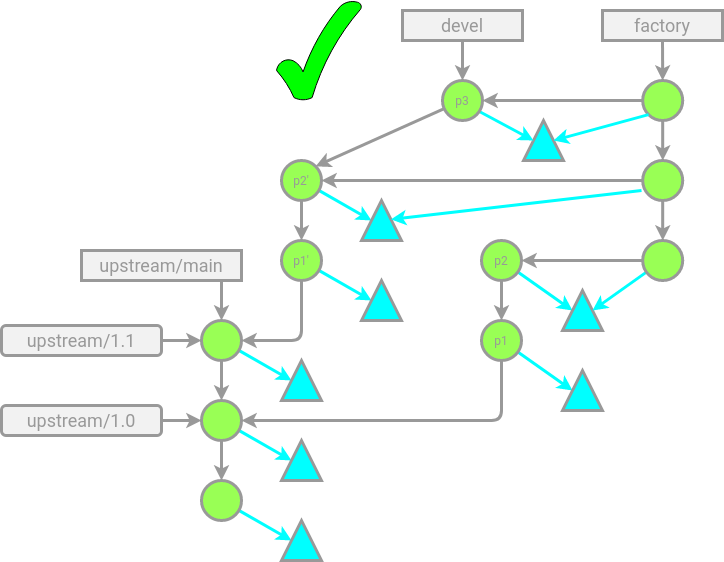

## Managing a project in git

Where there's one package there's usually more. It is desirable to
build packages together and have a single git revision to refer to
the composition. In OBS' terms that's called a project. A project is
basically a directory that contains packages in subdirectories.

### Monorepo/subtree approach

The same approach that works for single packages also works on
project level. As a project is an aggregation of packages in
subdirectories, the commits in the project need to refer to trees
that contain the packages in subdirectories.

With this approach the whole history of all packages and their
upstreams would be in one giant repository. When setting it up the
right way using subtrees every package still keeps it's own history.

There are two ways how a project could aggregate packages in this
model. One way would be to aggregate a factory branch as described
above. Another way would be to omit the per-package factory branch
and directly merge into the project as it was done on package level
before.

Again a custom merge method could be used:

	$ cat > ~/bin/git-merge-subdir <<EOF
	#!/bin/bash -e
	while [ "$1" != "--" ]; do
		shift
	done
	shift
	[ "$#" -eq 2 ]
	# Merge strategy that always uses the other tree, completely ignoring ours
	h="$1" # HEAD
	c="$2" # the actual merge commit
	: "${SUBDIR:?}"
	treeref="$(git rev-parse "$c^{tree}")"
	# replace existing subdir or add new one
	makenewtree() {
		local found=''
		while read m t r d; do
			if [ "$d" = "$SUBDIR" ]; then
				r="$treeref"
				found=1;
			fi
			echo -e "$m $t $r\t$d"
		done < <(git cat-file -p HEAD^{tree})
		[ -n "$found" ] || echo -e "040000 tree $treeref\t$SUBDIR"
	}
	newtreeref=$(makenewtree | git mktree)
	git read-tree "$newtreeref"
	EOF

	$ chmod 755 ~/bin/git-merge-subdir

### Merging the factory branch of packages into the project

	$ git fetch https://path/to/pkgA.git factory
	$ SUBDIR=pkgA git merge --allow-unrelated-histories -s subdir FETCH_HEAD
	$ git fetch https://path/to/pkgB.git factory
	$ SUBDIR=pkgB git merge --allow-unrelated-histories -s subdir FETCH_HEAD

With two packages A and B the history could look like this:

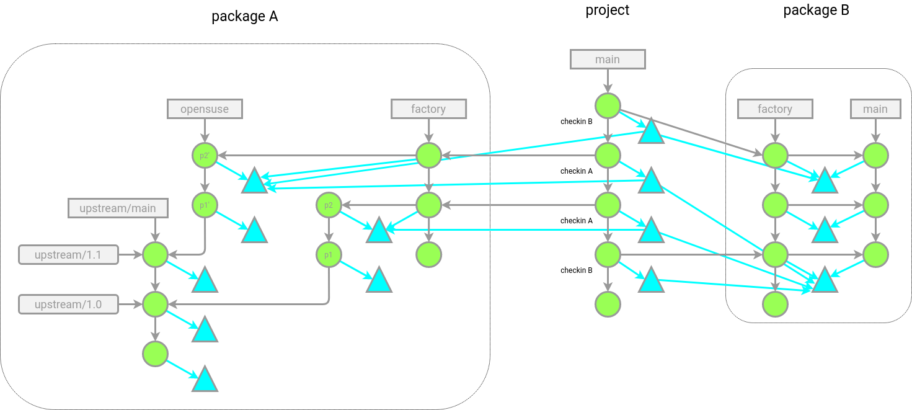

### Merging the package directly into the project

It's also possible to omit the _factory_ branch in packages and just
refer to the relevant commits themselves. That means the history of
a package is not really preserved in the package specific repos but
only in projects that use a package.

	$ git fetch https://path/to/pkgA.git opensuse
	$ SUBDIR=pkgA git merge --allow-unrelated-histories -s subdir FETCH_HEAD
	$ git fetch https://path/to/pkgB.git main
	$ SUBDIR=pkgB git merge --allow-unrelated-histories -s subdir FETCH_HEAD

The graph now looks a bit simpler:

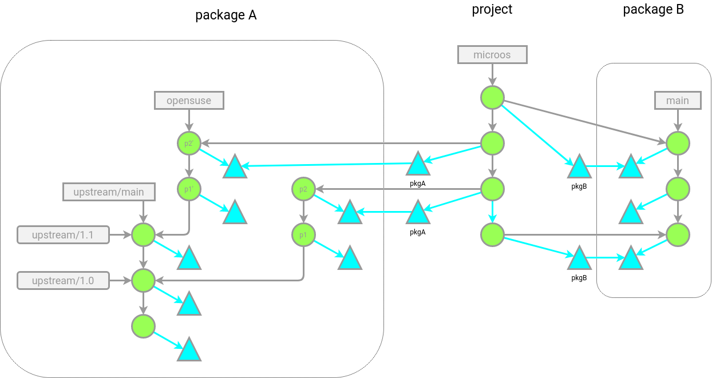

### Submodule approach

Monorepo/subtree recursively includes package history for each and
every package. That can be intended but for large repos might be a
disadvantage for size reasons. Git submodules were created to
overcome this disadvantage with a hack. Instead of chaining commits,
submodules use the tree instead.
As we've learned before, trees either refer to blobs or other trees.
In case of submodules a tree can refer to a commit. Taking the
simple subdir example from above but having the subdir as submodule
the tree would look like this:

    $ git ls-tree HEAD
    100644 blob 107edb072388276de5391a71dc5282f47a2066d5    .gitmodules
    160000 commit 0528507574f188a0b46b1f4c1e6d81f78b5dcfa0  subdir
    100644 blob 5716ca5987cbf97d6bb54920bea6adde242d87e6    foo

Or visualized:

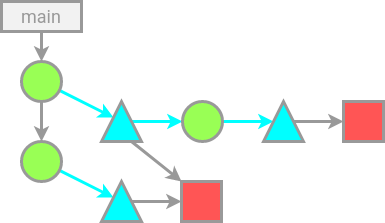

The referenced commit object is actually not stored in the same git
repo but comes from somewhere else:

     $ git cat-file -p 0528507574f188a0b46b1f4c1e6d81f78b5dcfa0
     fatal: Not a valid object name 0528507574f188a0b46b1f4c1e6d81f78b5dcfa0
     $ cd subdir
     $ git cat-file -p 0528507574f188a0b46b1f4c1e6d81f78b5dcfa0
     tree ee314a31b622b027c10981acaed7903a3607dbd4
     author [...]

Where from is specified in the _.gitmodules_ file:

    [submodule "subdir"]
        path = subdir
        url = https://git.example.com/subdir.git

Most of that magic is handled by the _git submodule_ command.

So a project that has packages in submodules could look like this:

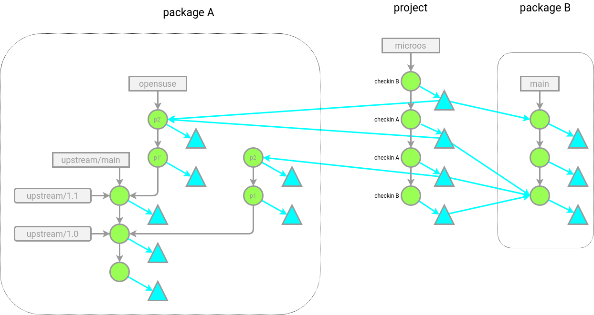

#### Pitfalls

##### Missing references

The commits references in the tree are intentionally not actually in the
project repo to save space. That however means it is not guaranteed that they
still exist in the linked repos. Garbage collection or force pushes could just
delete commits.

Therefore in the submodule approach package repos themselves do need
something like the _factory_ branch for each project that uses the
package. That branch needs to be protected in a way that it cannot
be removed or altered by the package repo owner.

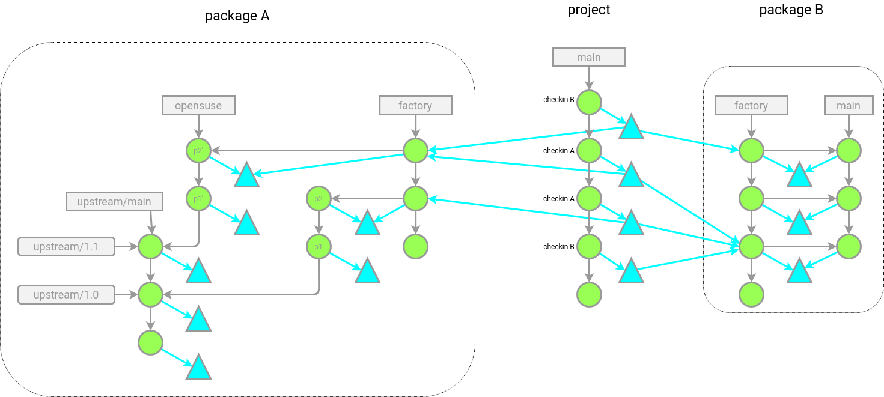

##### gitmodules file

A further complication is the _.gitmodules_ file. For one it's a
single file. So if multiple packages are to be added or removed,
submission need actual merging and may therefore conflict.

Also, the URL in submodule is normally an absolute one. That means a
project can't simply be mirrored to some other server including all
packages. The clone would still refer to the original server. An
alternative would be to use relative URL. Git interprets them
relative to the origin URL. A mirror would then have to replicate
the directory structure. Eg.

    [submodule "subdir"]
        path = subdir
        url = ../pool/subdir.git

# Addendum

## aaa_base

aaa_base is a SUSE owned package fully maintained in git, including spec file.
It's possible to build a _factory_ branch that resembles the checkins to the
actual _openSUSE:Factory_ by looking at the OBS history:

    $ git clone https://github.com/openSUSE/aaa_base
    $ cd aaa_base
    $ s="$(git commit-tree -m "start" "$(git mktree < /dev/null)")"
    $ p="$s"
    $ revs="$(osc api /source/openSUSE:Factory/aaa_base/_history|sed -ne 's/.*<version>.*+git.*\.\(.*\)<\/version>/\1/p')"
    $ for i in $revs; do
    $   p="$(git commit-tree -p "$p" -p "$i" -m "factory commit $(git rev-list "$s".."$p" --count)" "$i^{tree}")"
    $ done
    $ git update-ref refs/heads/factory "$p"

Even though the full history is present it's possible to only view the changes
relevant in the _factory_ branch:

	$ git log --oneline --first-parent factory
	3edbffb (HEAD -> factory) factory commit 2068
	70ab09d factory commit 2063
	8272183 factory commit 2060
	...

Or for example only the spec file changes:

	$ git log --oneline --first-parent factory -- aaa_base.spec
	3edbffb (HEAD -> factory) factory commit 2068
	c74e2aa factory commit 2053
	cd49bf4 factory commit 2050
	2833bea factory commit 2017

## Cockpit

The Cockpit package is maintained in git with an opensuse branch atop of every
upstream revision. It can be imported to produce a git repository as described
in this article:

    $ git clone https://github.com/openSUSE/cockpit
    $ cd cockpit
    $ s="$(git commit-tree -m "start" "$(git mktree < /dev/null)")"
    $ git tag -a cockpit "$s"
    $ p="$s"
    $ revs="$(git for-each-ref --format '%(refname)' 'refs/remotes/origin/opensuse-*')"
    $ for i in $revs; do
    $   p="$(git commit-tree -p "$p" -p "$i" -m "merge version ${i#*/opensuse-}" "$i^{tree}")"
    $ done
    $ git update-ref refs/heads/factory "$p"
	
	$ git describe --first-parent factory
	cockpit-13-g11f0abdd9

[^1]: https://en.wikipedia.org/wiki/Pristine_Sources
[^2]: http://ftp.rpm.org/max-rpm/ch-rpm-philosophy.html
[^3]: https://ibiblio.org/pub/historic-linux/distributions/bogus-1.0.1/Announce-BOGUS-1.0
[^4]: https://ibiblio.org/pub/historic-linux/distributions/bogus-1.0.1/bogus-1.0.1/notes/Announce
[^5]: https://github.blog/2020-12-17-commits-are-snapshots-not-diffs/
[^6]: `rpmbuild` as a `--build-in-place` option for that
[^7]: https://git-scm.com/book/en/v2/Git-Tools-Submodules
