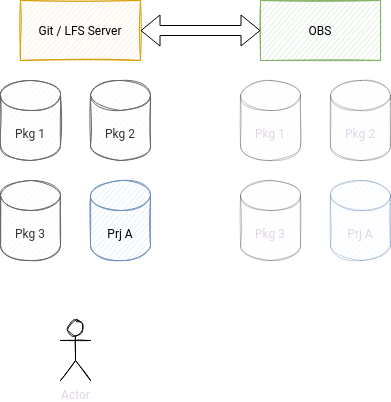

How to store the packages in git
================================

Proposals about how to store the source package information in git.


Traditional layout
------------------

With this schema we do not make any change in the current way that we
store the packages as currently done in OBS.

We will find the same compressed tarball, changes file, spec file and
maybe a set of patches.

A new .obs/ directory will be present to store some package
configuration or metadata file that will be required or used by OBS
(for example, for the Meta XML)

This layout is used in the obsgit[1] project, and can be used to
transition to a real git model.

The binaries can be stored using git-LFS[2], and there are simple
heuristics[3] to identify and track them.

Does not requires changes in the spec files and do not provide any
significant change in the workflow.  This makes it ideal as a first
step to introduce git in OBS (as OBS would be still used to define
projects, products, drive the review process and do the maintenance)


Full git layout
---------------

The git repository will store the source code directly.  When possible
this will be a clone of the original upstream repository, but in other
cases it will store the uncompressed version of the upstream tarball.

From here, we have several choices that must be evaluated.  Some of
them are enumerated here.


### Single master branch

The developer will put, in the same master / main branch all the
elements required to build a package.  Mainly a traditional "spec"
file.

The "Source" tag for the spec file will be missing, but a new
directory ".obs" will be present, with a "meta.xml" file that will use
the `<scmsync>` tag to point to the master branch, as is done in the
"git-example-2"[4] project from Adrian.

The git URL for `<scmsync>` for user projects can point to external
git services, like "gitlab" or "github", but for openSUSE project
should always point to the "code.opensuse.org" repository, to avoid
history rewrite.

For example, for my home project I can have:

```xml
<scmsync>https://github.com/user/package.git</scmsync>
```

Or if the user uses the openSUSE git service for their own project:

```xml
<scmsync>ssh://git@code.opensuse.org:user/package.git</scmsync>
```

But for the pool of packages that will build the distribution, it
should be something like:

```xml
<scmsync>ssh://git@code.opensuse.org:pool/package.git#Tumbleweed</scmsync>
```

The hashtag in the URL is used in some package manager to specify a
branch name.


### One branch per distribution

As a linear extension of the previous layout, the developer can have
multiple branches beside master / main, one per distribution.

The master branch can contain the package layout (source + spec +
.obs/) for the personal development user fork of the package, but
there will be an "Tumbleweed", "SLE-15-SP4", "ALP-16.0" for each
project where the package lives.

In each branch we will have maybe different source codes, different
spec files and the "meta.xml" will have different `<scmsync>` URLs for
the different branches.


### One branch for the code, multiple for distribution

Another alternative is to have one single branch (master / main) for
the code, and with multiple tags to represent the different upstream
version (pristine code) or downstream versions (code that contains
specific patches for the distributions), and multiple branches to
store only the information that belong to the package (spec + .obs/).

For example, we can have the named tag "v1.0" in the main branch that
is an exact pristine representation of the upstream code, but we can
have the named tag "v1.0-openSUSE" to point to a version of the same
code that contain on top our public patches.

We will still use multiple branches per distribution to store the spec
file and the metadata that will point to the correct tag.

For example, the "meta.xml" file in the "Tumbleweed" branch will
contain this line:

```xml
<scmsync>ssh://git@code.opensuse.org:pool/package.git@v1.0-openSUSE</scmsync>
```

I am using "@" to differentiate branches from tags, but if the norm is
to use "#", should be used this instead.


### Other layouts

There are other valid source code layout, but IMHO are not suitable
for workflows that are git-friendly.

For example, the "git-example-1"[5] from Adrian is storing in the git
repository only the information about the package, delegating into OBS
the download of the pristine tarball (via #!RemoteAsset from pbuild).

This is not really suitable to work with git, as you lose the ability
to work with the source code and develop patches on top (nor those can
be migrated and shared between different code streams)

In the same way, "git-example-3"[6] is referencing the package source
using a second git instance (this time via #!RemoteAssetUrl
extension), but is again sharing the same problems that before.
Sharing code between different code streams will be very cumbersome,
as there are different git repositories involved (that represent
different concepts) that should be synchronized).

But any other layout that put together the source code the rest of
assets required to build a package, can be evaluated.


Project layout
--------------

A project should be considered as a aggregation of packages and some
metadata that set some OBS properties (like the project config).

This should resolve the mono-repo problem.  A collaboration from an
user do not require the clone of a big repository.  But also this
approach will help the release manager, as can have full control of
the distribution, using a not verify different mechanism that OBS use
today (_link file).

Git support two models to build on this concept: submodules and
subtrees.

Submodules are older, extensively documented and on the paper reflect
better the intention.  A submodule is represented as a git commit to a
different repository in the history.  It is possible to change the
commit hast that a specific submodule is pointing, and from the
release manager PoV is an explicit operation.

On the bad side submodules can be confused, and the CLI is a bit
cumbersome (initialization is multi steps in some cases and not in
others).  This should be fixed with clear documentation, and not with
helper tools (as there is a risk of complicating more the scenario).

Subtrees is a more recent alternative, more oriented to support
changes in place.  It is more clear when we are making changes in the
parent git or in one of the subtrees, and the CLI will do the right
thing for us.  This incentive a work model for the release manager
with less steps.  They can have a partial checkout of the full
project, and make in-place changes and fixes in subpackages, and when
a "git commit" is done, it will be delivered to the correct
repositories.

In any case both approach will support very similar work models, and
any difference should be fixed with documentation and a best-use
examples.

Also, in the same way a new ".osc/" directory will be added to store
the configuration files and metadata (like the project config) that
belong to OBS.


Use cases
=========

Lets describe some use cases for those layouts, and see how is
expected to work.

Should be noted that IMHO we should support the traditional layout for
a very long time, as is the less disruptive one (also the less
flexible).  Over the time (and in different stages) a full git layout
should be deployed one user demand.


User add / remove a package using the traditional layout
--------------------------------------------------------

In this scenario we will create a new package, but using the
traditional layout (raw tarballs and package assets all together).  We
will use LFS to track the binary files and we will delegate into OBS
all the review, release and maintenance process.

We also introduce an optional tool `git-obs` that does some of the
actions that `osc` is doing today, but adapted to the git use case.
For example, creating a new package will require the presence of a
metadata file in a new directory, and this tool will create one for us
and reference a default project in our home.

```bash
> mkdir package; cd package

# git-obs is a git plugin, and the `init` subcommand will create
# the initial prackage structure.  This can be done manually too.

> git obs init
> ls -a1
.git
.obs

> ls .obs
meta.xml

> cat .obs/meta.xml
<package project="home:user" name="package">
  <title/>
  <description/>
</package>

# We can register the origin remote via `git remote`, and later
# update the meta.xml, or use `git obs remote`.
> git obs remote add origin git@code.opensuse.org/user/package.git
> cat .obs/meta.xml
<package project="home:user" name="package">
  <title/>
  <description/>
  <scmsync>ssh://git@code.opensuse.org:user/package.git</scmsync>
</package>

> git remote -v
origin  git@code.opensuse.org:user/package.git (fetch)
origin  git@code.opensuse.org:user/package.git (push)

# We use LFS to track large files
> wget https://all-packages/package-1.0.0.tgz
> git lfs install

# The default LFS server is associated with the remote URL.  For this
# case the end point should be (`git lfs env`)
# - (SSH)   git@code.opensuse.org:aplanas/package.git
# - (HTTPS) https://code.opensuse.org/user/package.git/info/lfs
#
# Those endpoints can be changed via the "lfs.url" config field[7]

> git lfs track '*.tgz'
> git add .gitattributes package-1.0.0.tgz

# Create the spec and change files
> emacs package.spec package.changes
> git add *

> git commit -a -m "Initial package"

# Again, this is for convenience, as can be done manually.  In this
# case would be a `git push`, to add the content into the git server,
# and a chain of `osc api -x PUT/POST` to create the empty package and
# upload the .osc/meta.xml
> git obs push
```

Remove a package should be like:

```bash
> cd package

# This maintain the package representation in OBS, but remove the link
# (scmsync) in the meta.
> git osc rdelete --soft

# This remove the package completely in OBS, but keep the one in git.
> git osc rdelete
```


User works with a package using the traditional layout
------------------------------------------------------

Daily work of an user in OBS, using the traditional layout (keeping
tarballs, and delegating into OBS the review / release process as
today)

```bash
# If the package is already in Factory, it will live in "pool", so we
# need to start forking it
> git obs fork https://code.opensuse.org/pool/package

> git clone ssh://git@code.opensuse.org/user/package.git

> cd package

> ls -a1
.git
.gitattributes
.obs
fix-01.patch
package-1.0.0.tgz
package.changes
package.spec

# The metadata information for the package is in .obs/meta.xml,
# because is not a new package.

> cat .obs/meta.xml
<package project="home:user" name="package">
  <title/>
  <description/>
  <scmsync>ssh://git@code.opensuse.org:user/package.git</scmsync>
</package>

# We are using git-lfs to store the binary files, for that we have the
# ".gitattributes" file

> git lfs track
Listing tracked patterns:
   ...
   *.tgz (.gitattributes)
   ...

> git lfs ls-files
a8fc3d48d9 - package-1.0.0.tgz

> wget https://all-packages/package-1.0.1.tgz
> git rm package-1.0.0.tgz
> git add package-1.0.1.tgz
> git status
...
        deleted:    package-1.0.0.tgz
        new file:   package-1.0.1.tgz

> emacs package.spec package.changes

> git commit --signoff -a -m "Update to 1.0.1"
> git push
```

This version can be extended a bit, for example using in the `scmsync`
tag a pointer to a branch.  This will allow some improvement over the
current way that OBS handle source packages.  Multiple branches in the
traditional layout will reference different code stream (Tumbleweed,
SLE-15, ALP, etc).  In this case the metadata will be also different,
with different `<package project="">` and different `<scmsync>`.

To contributing back into the forked project we should do an `osc sr`
under this model.


User add / remove a package using the full layout
-------------------------------------------------

In this scenario we will create an empty git repo.  In the master /
main branch we will have the pristine git clone (or unpacked tar ball)
of the upstream project, and in the different branches we will have
different version of the same package with different OBS metadata and
spec files.

```bash
> mkdir package; cd package

> git init
> ls -a1
.git

# I am sure that git-obs can help here with a different subcommand,
# for example, all this full scenario can be done with:
# > git obs mkpac https://github.com/org/package.git

> git remote add origin git@code.opensuse.org:user/package.git
> git remote add upstream https://github.com/org/package.git
> git remote -v
origin  git@code.opensuse.org:user/package.git (fetch)
origin  git@code.opensuse.org:user/package.git (push)
upstream        https://github.com/org/pacakge.git (fetch)
upstream        https://github.com/org/package.git (push)

> git fetch --all
> git checkout -b main --track upstream/main

# Create the different branches
> git checkout tags/v1.0 -b Tumbleweed
> ls -a1
.git
Makefile
package.c

> git obs init --project home:user --branch Tumbleweed
> ls -a1
.git
.obs
Makefile
package.c

> cat .obs/meta.xml
<package project="home:user" name="package">
  <title/>
  <description/>
  <scmsync>ssh://git@code.opensuse.org:user/package.git#Tumbleweed</scmsync>
</package>

> git commit --signoff -a -m "Initial package"
> git obs push
```


User works with a package using the full layout
-----------------------------------------------

In this scenario we have a package that is present in Tumbleweed and
in SLE.

```bash
# If the package is already in Factory, it will live in "pool", so we
# need to start forking it
> git obs fork https://code.opensuse.org/pool/package

> git clone ssh://git@code.opensuse.org/user/package.git

> cd package

> git branch --list
  SLE-15-SP4
  Tumbleweed
* main

# Main / master is a pristine copy
> ls -a1
.git
Makefile
package.c

# Contains the metadata (.obs) and the package spec file
> git checkout Tumbleweed
> ls -a1
.git
.obs
Makefile
package.c
package.changes
package.spec

> git remote add upstream https://github.com/org/package.git
> git remote -v
origin  git@code.opensuse.org:user/package.git (fetch)
origin  git@code.opensuse.org:user/package.git (push)
upstream        https://github.com/org/pacakge.git (fetch)
upstream        https://github.com/org/package.git (push)

> git fetch --all

# We assume that we have commits in the Tumbleweed branch that are not
# in the upstream, so we want to update the code and add our patches
# on top
> git rebase upstream/main
> emacs package.spec package.changes
> git commit --signoff -a -m "Update package"

# Backport some fixes from upstrem in the SLE branch
> git checkout SLE-15-SP4
> git cherry-pick -x $SHA256
> emacs package.spec package.changes
> git commit --signoff -a -m "Fix bad issue"
> git push --force

# Because the OBS - git is already stablished, OBS will start building
# the package, if not we can trigger the build manually
> git obs build

# We can do local builds, fetching the build dependencies from OBS, or
# using the new pbuild mechanism
> git obs build --local

# To contribute back into the foked project we can go to the Git
# server (Gitea, Pagure, ...) and do a pull request from our fork to
# the pool version of the package.

# Another alternative is to extend `git-obs` to do the job for us.
> git obs pr
```


User submit a maintenance update
--------------------------------

TBD


User share code with others
---------------------------

TBD


Re-using packages from other distributions
------------------------------------------

TDB


User fix an embargoed CVE
-------------------------

TBD


Release manager updates Tumbleweed
----------------------------------

TBD


Architecture
============

TBD (OBS, git-obs, git service)



Done with diagrams.net[8]


References
==========

[1] https://github.com/openSUSE/obsgit  
[2] https://git-lfs.github.com/  
[3] https://github.com/openSUSE/obsgit/blob/master/obsgit/obsgit.py#L716  
[4] https://build.opensuse.org/package/meta/home:adrianSuSE:OBSGIT/git-example-2  
[5] https://github.com/adrianschroeter/git-example-1  
[6] https://github.com/adrianschroeter/git-example-3  
[7] https://github.com/git-lfs/git-lfs/wiki/Tutorial#lfs-url
[8] https://www.diagrams.net/
